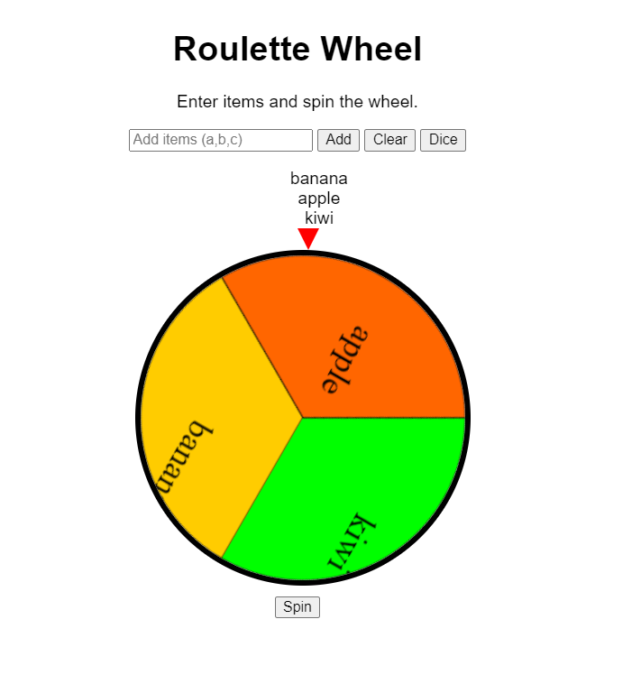

# Wheel of fortune

 
<strong>StartPage sreenshot</strong>

## Overview

The Roulette Wheel is an interactive web application that allows users to create a customizable wheel with different items, spin it randomly, and get a result. It's a versatile tool that can be used for decision making, games, or random selection processes. I got the idea for ths app when me and group of my friends weren able to decide for witch restaurant
to visit. When I started to make this my idea was to make it as universal as possible. App is hosted at [spin.dudo.fi](https://spin.dudo.fi)

## Features

- **Add Items**: Enter one or multiple items separated by commas or semicolons
- **Clear Items**: Remove all items from the wheel
- **Dice Mode**: Quickly transform the wheel into a 6-sided die
- **Spin Wheel**: Randomly spin the wheel to select an item
- **Visual Feedback**: Color-coded wheel sections with item labels

## Technical Implementation

### HTML Structure

- A heading and description
- Input field for adding items
- Buttons for core functions (Add, Clear, Dice, Spin)
- A list display showing current items
- Canvas element for rendering the wheel
- Pointer element indicating the selected item

### CSS Styling

- Centered layout with Arial font
- Wheel rendered as a circle with a black border
- Red pointer to indicate the selected section
- Smooth transition animation for spinning

### JavaScript Functionality

#### Core Variables

- `items`: Array storing all items added to the wheel
- `wheel`: Reference to the canvas element
- `ctx`: 2D drawing context for the canvas
- `angle`: Tracks the current rotation angle

#### Functions

1. **`addItem()`**
   - Captures text from the input field
   - Splits input by commas or semicolons
   - Adds each item to the items array
   - Updates the visual list and wheel display
   - Clears the input field

2. **`updateItemList()`**
   - Clears the existing list display
   - Creates list elements for each item
   - Appends items to the display list

3. **`clearItems()`**
   - Resets the items array to empty
   - Updates the visual list and wheel display

4. **`makeDice()`**
   - Sets the items array to numbers 1-6
   - Updates the visual list and wheel display

5. **`drawWheel()`**
   - Clears the canvas
   - Calculates slice angle based on number of items
   - Uses 5 distinct colors (yellow, orange, pink, blue, green)
   - Ensures adjacent slices have different colors
   - Draws each slice with its label centered

6. **`spinWheel()`**
   - Validates that items exist
   - Calculates a random number of rotations (5-14 full spins)
   - Randomly selects a section to land on
   - Applies CSS transform to animate the rotation

## Usage Instructions

1. **Adding Items**:
   - Type a single item and click "Add", or
   - Enter multiple items separated by commas (e.g., "Red, Blue, Green") and click "Add"

2. **Creating a Dice**:
   - Click the "Dice" button to automatically create a 6-sided die

3. **Clearing the Wheel**:
   - Click "Clear" to remove all items

4. **Spinning the Wheel**:
   - Click "Spin" to randomly rotate the wheel
   - The wheel will stop with the pointer indicating the selected item

## Technical Considerations

- The application uses HTML5 Canvas for rendering the wheel
- CSS transitions provide smooth animation
- Color selection algorithm ensures visual distinction between adjacent sections
- The wheel will not spin if no items have been added

## Potential Enhancements

- Sound effects for spinning and selection
- Option to save and load different wheel configurations
- Adjustable spin time and animation effects
- Mobile-friendly touch controls
- Ability to remove individual items
- Custom color selection for wheel sections
